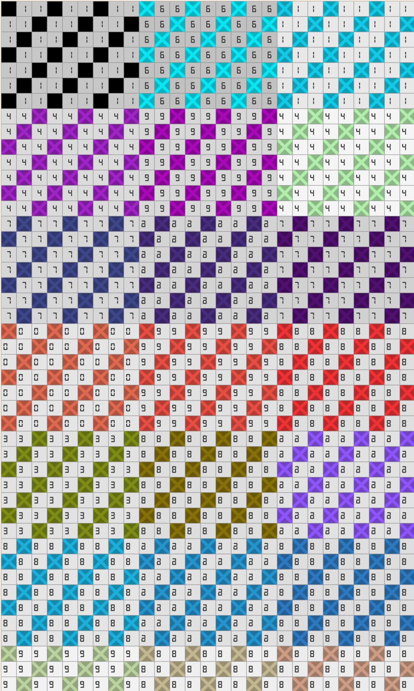

# Эксперименты технического разбора, 26.09.2026

**Это не код игры.** Три коротких опыта, которые проверяли решения документов до
прототипов: шейдер канвы, сборка узора из снимка, размер файла стежков. Они — отправная
точка для прототипов П2–П4 ([`docs/specs/2026-09-spikes.md`](../../docs/specs/2026-09-spikes.md)),
а выводы уже записаны в [`docs/02-architecture.md`](../../docs/02-architecture.md),
[`docs/04-data-model.md`](../../docs/04-data-model.md) и
[`docs/specs/2026-09-content-pipeline.md`](../../docs/specs/2026-09-content-pipeline.md).

```bash
cd research/feasibility-2026-09
bun install
bun shader.ts                 # шейдер канвы на CanvasKit, кадр — shader-frame.png
bun exp.ts снимок1.jpg …      # снимок → узор: цвета, одиночные клетки, размер
bun log.ts                    # файл стежков: размер при разных способах записи
```

## `shader.ts` — вся канва одним шейдером

Узор 150 × 200, 32 нити, половина клеток вышита. Шейдер `RuntimeEffect` (SkSL) получает три
текстуры — клетки, палитру 64 × 1 и атлас цифр (здесь — «семисегментные» цифры вместо шрифта) —
и за один проход рисует крестики на вышитых клетках, бледный тон и номера на невышитых,
сетку и подсветку выбранной нити. Запуск — на CanvasKit 0.41.0, той же версии, что у
`@shopify/react-native-skia` 2.6.2 (Expo SDK 57) в вебе, на процессоре.

- Шейдер собирается по правилам `RuntimeEffect`; палитра — текстура, потому что индекс
  массива в SkSL должен быть постоянным.
- Цвет в центре каждой проверенной вышитой клетки совпал с палитрой: **418 из 418**
  (400 далеко и 18 близко; перепроверено при переносе сюда).
- Кадр 1080 × 1800 на процессоре — 3–5 с: для телефона это ничего не значит (там рисует
  видеокарта), а для золотых кадров в тестах годится на маленьком размере.



## `exp.ts` — снимок → узор

Уменьшение по площади в линейном свете → k-means++ в OKLab (зерно 12345) → слияние нитей
ближе 0,05 → без дизеринга → чистка областей меньше трёх клеток (в соседа с самой длинной
общей границей, до шести проходов). Прогон на пяти снимках (сами снимки в репозиторий
не кладутся: их лицензии не проверялись):

| Снимок | Сетка | Нитей после слияния (из 32) | Одиночные клетки: до → после | Клетки в областях до 3: до → после | Клетки после deflate |
|---|---|---|---|---|---|
| город | 150 × 93 | 23 | 5,8 % → 0 % | 13,2 % → 1,7 % | 1,9 КБ |
| кот | 150 × 144 | 18 | 7,4 % → 0 % | 14,8 % → 1,1 % | 1,5 КБ |
| фактура | 150 × 100 | 17 | 13,7 % → 0,1 % | 26,6 % → 1,7 % | 3,3 КБ |
| то же, мелко | 60 × 40 (из 16) | 15 | 21,5 % → 0,4 % | 42,3 % → 2,7 % | 0,6 КБ |
| портрет | 150 × 325 | 23 | 7,2 % → 0 % | 12,0 % → 0,8 % | 6,3 КБ |

Один вариант — 0,1–0,5 с на наивном JS. Вывод: чистка обязательна, а 32 заказанных цвета
у снимков дают много почти-повторов.

## `log.ts` — файл стежков

Узоры 100 × 100 и 150 × 200, 24 нити; порядок стежков — «строками» и «кусками вразброс».
Клетка как разность с предыдущей в «зигзаге» varint — около 1,1 байта на клетку; для
150 × 200 это 32–35 КБ без сжатия (0,3–20 КБ после deflate), битовая карта — 3,75 КБ.
Отсюда порог файла законченной работы 120 × 120 в прототипе П4 — 40 КБ.
